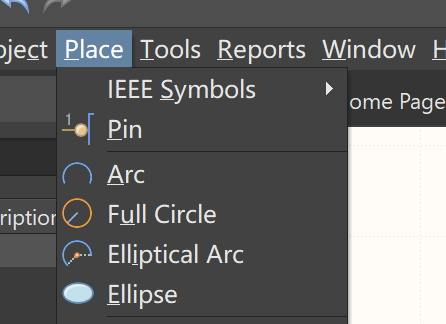
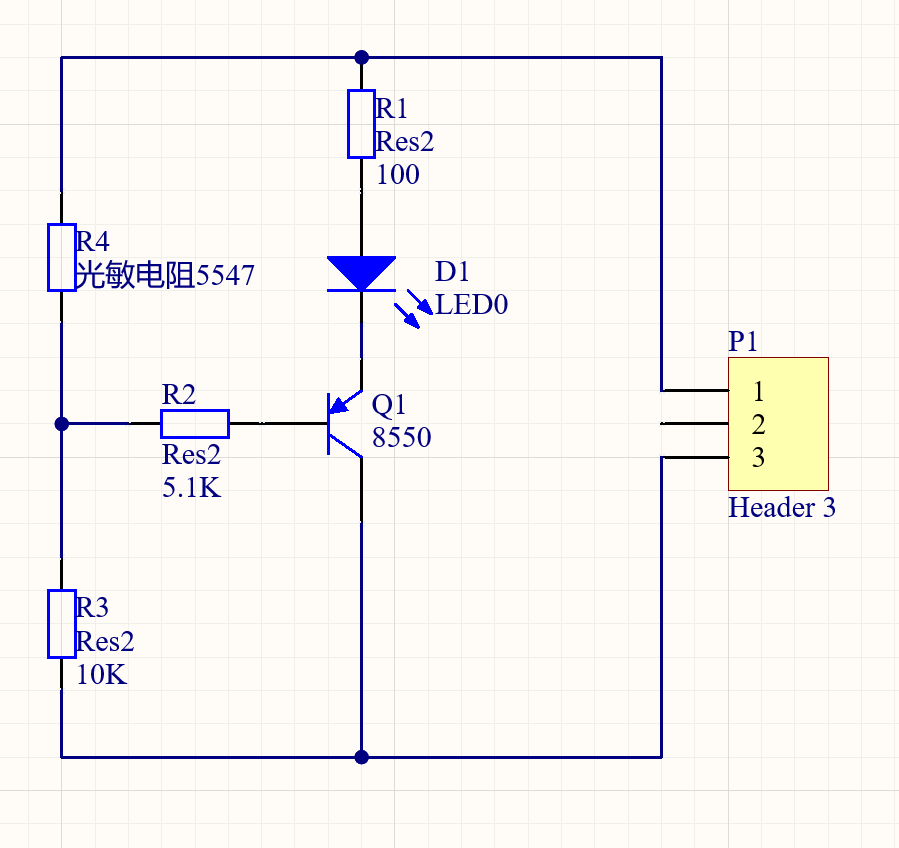
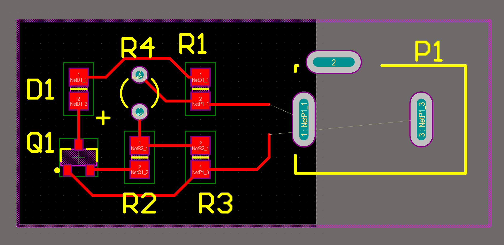

# 入门PCB设计（视频学习 杜洋工作室）

学习杜洋的PCB设计，视频链接：`https://www.bilibili.com/video/BV1w7411s7De`

`Altium Designer`版本说明：视频用的是AD9，我装的是AD21

## 第1集 软件基本介绍

### 1. 介绍Altium Designer的基本窗口

### 2. 新建工程

1. 选择Project新建工程

2. 右键工程查看选项

* `Schematic`：原理图
* `PCB`：PCB图
* `Schematic Library`：原理图元件库（官方提供的库焊盘比较小，是考虑机械焊接的，如果是自己焊接使用，需要自己封装）
* `PCB Library`：PCB原件库
* `CAM Document`跟工厂联系时的光绘文件

3. 往工程添加：

   * 原理图

   * PCB

   * 原理图元件库

   * PCB元件库

     

## 第2集 在原理图上增加元器件及DIY元件库的方法

概览：

* 如何新建原理图
* 在原理图上添加官方的元件库
* 如何自己建一个元件库

### 新建原理图

新建原理图后：

* 原理图界面的右下角有个框，用来显示名字、规格、日期等

* 剩下的部分是用来绘制原理图的区域

### 添加官方元件库

#### 官方元件库

点击右侧的`Components`，主要有两个库：

* `Miscellneous Divices.IntLib` 元器件
* ``Miscellaneous Connectors.IntLib` 插件（排针之类的）

#### 添加官方元件库

直接拖动官方库里的元件到原理图里面

#### 放置线

选择`Place`-->`Wire`（或者快捷键pw）

### 制作元器件原理图库--芯片、排针类的器件

#### 新建原理图元件库

新建一个原理图元件库，双击元器件，右侧弹出框可以修改元器件名字，这边修改为`miniUsb`。（`Designator标识`写`USB1`，这边漏掉了）

操作：

* `ctrl`+滚轮可以放大或缩小工作区
* 鼠标右键可以拉动工作区的位置

#### 放置轮廓

`Place`-->`Rectangle` 放置一个矩形轮廓

操作说明：

* 右击可以取消放置新的轮廓

> 提示：
>
> 原理图元件库和pcb元件库是不一样的，pcb元件库关注实际的尺寸和样子及引脚的位置，原理图元件库不需要关注这些，只需要在原理上做一个解释，只要引脚数正确就行。

#### 放置引脚

`Place` --> `Pin`可以放置引脚

操作：

* 鼠标焦点一端是对外的引脚口

* 引脚还没放置前，`tab`键可以调出属性设置框：

  * Designator 标识（引脚号）
  * Name 显示名称

  

画好后效果：

#### 放置到原理图中

点击`SCH Library`对话框中的`place`按钮，就可以添加到原理图库中

### 制作元器件原理图库--LED、电池类

#### 新建器件

`Tools`-->`New Component` --> 取名`LED` -->点击ok

#### 画外形

快捷键p-->选`线`-->绘制外形

给三角形填充颜色：

p-->多边形-->跟着三角形描绘一遍-->双击多边形-->设置填充颜色和边框颜色与大小

添加引脚：设置引脚长度、显示名称不可见、标识改为`+`

添加一个负引脚：

使用线 画两个箭头

> 用快捷键g可以调整挪动的距离

#### 放置到原理图的效果

## 第3集 一个完整电路原理图的画法及操作流程

画一个光敏小夜灯的电路

### 1. 放置第一个电阻

放置电阻R1：`Components`-->`Miscellaneous Devices.IntLib` --> 搜索`Res2` -->放置到原理图-->设置标识(Designator)为R1。

> 修改阻值可以直接双击值（图中的100）的那个位置。

### 2. 放置其他元器件

摆放位置：

### 3. 连线

使用pw快捷键连接电路图。

### 4. 加入图纸信息和注释

使用pt快捷键来写文本，给图纸增加备注

## 第4集 导PCB板图

内容概要：

* 导PCB板图
* 改变封装
* 简单布局
* 画PCB尺寸

### 1. 查看元器件的封装

集成库：元器件的PCB封装和原理图绑定

> PCB封装指元器件的焊盘及样式

查看元器件的PCB封装：点击工具-->封装管理器

### 2. 导PCB板

1. 新建pcb文件

2. 回到原理图 -->Design菜单-->`Update PCB Document xxx`

   

3. 弹出的对话框“工程更改程序”：

   点击`Validate Changes`生效更改-->`Excute Changes`执行更改

   

   > 改对话框主要用来检查更改，使更改生效

   * `Validate Changes`生效更改：计划让你勾选的更改生效
   * `Excute Changes`执行更改：让你勾选的更改生效
   * `Report Changes`报告更改
   * `Only Show Errors`仅显示错误

4. 执行效果：在pcb图右下脚有原理图中对应的元器件

   

   > 上图红色方框是在多元件的时候有用，现在没有用到，直接选中用delete件删除即可，免得妨碍视线。

5. 拉动元器件到图纸中，调整合适的位置，效果如下：

   

   > 拖动元器件的时候，可以使用空格改变元器件方向
   >
   > 元器件布局走线短、少绕、元件整齐美观为准

6. 重新定义板子的形状

   Design(设计)-->板子形状(Board Shape)-->Define Board Shape from Selected Objects

   

   实际操作报了下面的错误：

   > Could not find board outline using primitives centerline duo to the following error
   > At least 2 connected tracks/arcs or full circle required
   > Would you like to try finding board outline using primitives external edges instead?

   原因是软件找不到要分割的PCB板框

   解决方法：

   1. 右键-放置-keep out-线径，画一个完整闭合的形状，选择这个形状/边框：Place——KeepOut——Track
   2. 按照需要的形状，画出边框（需要闭合的图形）
   3. 画好后，用选中框（直接鼠标左键拖动）选中整个边框
   4. 设计-板子形状-按照选择对象定义：Design——Board Shape——Define from Selected Objects
   5. 完成板子的剪切。

   效果如下：

   

   > 注：
   >
   > 1. 上面的操作和视频不太一样，因为找不到Design(设计)-->板子形状(Board Shape)中找不到"重新定义板子形状"的选项。
   >
   > 2. 要看板子的实际尺寸可以用尺子工具测量

### 3. 查看3D效果

`view` --> `3D Layout Mode `

效果如下：

按照`shift`+鼠标右键可以有挪动的3D效果

### 4. 修改元器件封装

把直插的元器件修改成贴片的，光敏电阻修改成类似LED的封装。

1. Tool--> aaa-->选择3个电阻-->点击编辑

   

2. 选择`Any`-->`Browse`

3. 找到6-0805-M，点击ok --> ok 。三个电阻的封装形式就改变了。

>  视频中有 2012[0805]和2012_Chip两种（单位不一样，一个是英制的，一个是米的） 。但是在AD21中找不到。

4. 同样的方法：

   * 光敏电阻改成R38封装

     

   * LED改成`6-0805-M`

   * BT1电源为`BAT-2`

   * Q1为`SOT-23B-L`

5. 点击采纳变化

6. `Engineering Change Order`对话框中选择`Validate Changes` --> `Execute Changes`

7. 重新进到元器件管理界面就可以看到修改生效了

   

8. 更新pcb图 `Designer` --> `Update PCB Document xxx`

9. 对话框中选择`Validate Changes` --> `Execute Changes`

10. 效果如下：

    

    

## 第5集 PCB图布局与排线

布局首先要考虑重要接口、传感器的位置分布；至于电容、电阻这些不在乎特定位置的元件，布局以线路最短、制作最方便这些原则来排布。

栅格操作：

* 拖动栅格：在拖动元器件的时候按`g`，调整拖动时的栅格大小
* 按g：可以选择栅格的大小
* 按gg：可以输入栅格的大小

板子4边正常有个50mil的安全区

### 布线

快捷键：pt选择布线

tab键可以设置线的大小，一遍设置10mil就可以了

> 如果设置大小太大，会设置不了，因为有规则的限制。这个规则可以更改，后续视频解释，目前还没讲。
>
> 布线不能走直角（软件会自动不走直角），直角会有一些高频信号的干扰吧。

使用连线把元器件连接起来，效果如下：

## 第6集 PCB布局与排序（续）

图层：途中颜色不一样的字体或图形都是在不一样的图层中。

> Keep-Out Layer 禁止布线层

### 1. 剪切大小

1. 选择`Keep-Out Layer`禁止布线层

2. 使用快捷键`pl`选择画一个方块，如下图所示：

   

3. 测量实际大小：使用快捷键`Ctrl`+`m`，选择两点之间可以测量距离

   

4. 重新定义板子形状：

   * 选中方框及所有元器件

   * 选择：`Design`-->`Board Shape` --> `Define Board Shape from Selection Objects`

### 2. 查看3D效果

`View` --> `3D Layout Mode`

### 3. 设计规则检查

1. 回到2D视图模式

2. `Tools` --> `Design Rule Check(设计规则检查)` --> `Run Design Rule Check`，生成检查报告

   

   可以看到这边有9个错误，分别是丝印到焊盘的间距、丝印到丝印的间距。

3. 回到pcb图界面 --> 点击右下角的`Panels` --> 选择`messages`调出消息对话框-->双击错误点就可以跳到出错的地方,进行更改即可。

   > 丝印到丝印的错误可以通过挪动丝印使距离拉大来解除错误，丝印到焊盘的距离不知道怎么解除，因为这边使用的是官方库，改错误来自官方库的丝印和焊盘间距太小（视频中使用的电阻元器件不太一样，所以没有该错误）。

4. 添加`+`的标号

   快捷键`ps`添加一个`+`的符号到光敏电阻中

   

   > 每次改完图纸后，需要重新进行设计规则检查，看看是否有错

### 4. 其他

pcb板画好后还可以在图里面加一些版本号、创建者信息等。

## 第7集 PCB元件库设计

本节内容：

把电路图中的电源改成`DC 2.1`

> 需要更加电源插座的规格手册来制作PCB元件库，可以通过百度搜`DC 2.1 pdf`来获取
>
> 2.1应该指的是电源插孔的大小2.1mm

封装绘制包括：

* 引脚过孔及焊盘
* 元器件边框丝印

### 1. 替换原理图中的电源

把原理图中的电源替换成3Pin的插座，效果如下图所示：

> 注：Header3中的1叫是正极，3叫是负极

### 2. 添加pcb的元件库

`DC 2.1`的图纸：

添加pcb的元器件：

1. 新建pcb源库图

2. 切换到`Top Overlay`绘制丝印边框

3. 设置栅格（快捷键g）为1mm

4. 画一条穿过中心原点的线，当中基准线使用。（快捷键 pl）

   

5. 添加焊盘：快捷键pp

   > 切换单位：把mil改成mm，`view` --> `Toggle Units` （也可以使用快捷键 `ctrl` + `q`）

   绘制参数如下：

   

   

   总共绘制3个焊盘：

   

6. 设置3脚焊盘位置（距离辅助线为3.7mm），输入gg设置3.7mm

   > 利用栅格大小来调整位置

   设置另外两个脚：

   * 1脚距离13.5mm
   * 2脚距离11mm，y轴4.8：通过选中焊盘，按m，选择`Move Selection by X,Y`设置移动大小

   效果如下：

   

7. 画轮廓：

   1) 修改宽度线为startX, startY为0, -4.5  endX,endY为 0,4.5

   ​	

   2) 把栅格大小改成4.5mm：快捷键gg -->4.5mm

   3) 画右侧轮廓： 把栅格大小改成14.5mm；`ctrl + c` --> 左键点击原点为参考点 --> `ctrl + v` 粘贴 -->左键选择粘贴点

   ​	

   4) 画完另外两条轮廓：pl -->画轮廓

   ​	

   5) 

### 3. pcb元件库和原理图关联

1. 回到原理图

2. Tools --> `Footprint Manager` --> 选择`Header 3` --> `edit` -->弹框选 `Any` -->`Browse` -->选`PcbLib1.PcbLib`库

    

3. 点击`Pin Map`确认引脚是否对应

   

4. `ok` --> `ok` --> `Accept Changes(Create Eco)`

   

5. `Validate Changes` --> `Execute Changes`  --> 保存原理图

6. 更新pcb:`Design` --> `Update PCB Document xxxx`

   

7. 生效更改/执行更改：`Validate Changes` --> `Execute Changes`

   

8. 删掉红框：

   

### 4. 去掉电源pcb元件库多余的线

电源pcb元件库的线传过了焊盘，会有报警，现在去掉多余的线

1. 把栅格改成1mm: gg-->1mm

2. 选中要切割的线 --> e（编辑的快捷键） --> `Slice Tracks` 切断轨迹，切割完后的效果：

   

3. 更新变化：

   

4. 扩大板子：

   * 拉大外框

     

   * 选中所有元素-->`Designer` --> `Board Shape` --> `Define Board Share frome Selected Objects`

     

5. 连好线

   

6. 设计规则检查：

   `Tools` --> `Design Rule Check`--> `Run Design Rule Check`

7. `P1`改成`DC 6V`

   

### 5. 查看3D效果图

